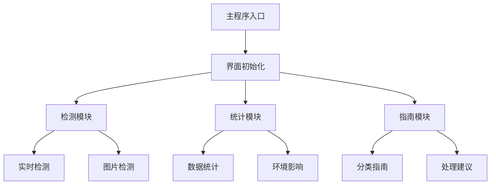

# 基于YOLOv8的智能垃圾分类识别系统

基于YOLOv8的智能垃圾分类识别系统，支持实时摄像头检测和图片上传检测，具有现代化的界面设计和完整的数据分析功能。

项目地址：[https://mbd.pub/o/bread/YZWVl5ZwaA==](https://mbd.pub/o/bread/YZWVl5ZwaA==)

项目展示：[https://player.bilibili.com/player.html?aid=114845244464764]


## 功能特点

- 实时摄像头检测
- 图片上传检测
- 数据统计分析
- 环境影响评估
- 垃圾分类指南
- 现代化深色界面
- 中英文双语显示

## 数据集说明

数据集位于 `yolo_dataset` 目录下，包含以下内容：

- **图像数据**：位于 `images` 目录，包含1347张垃圾物品图片
- **标注数据**：位于 `labels` 目录，采用YOLO格式的txt文件
- **类别文件**：`classes.txt` 定义了10个垃圾类别

### 支持的垃圾类别

1. Bottle（瓶子）- 可回收物
2. Bottle cap（瓶盖）- 可回收物
3. Can（罐子）- 可回收物
4. Cigarette（香烟）- 有害垃圾
5. Cup（杯子）- 可回收物
6. Lid（盖子）- 可回收物
7. Other（其他）- 其他垃圾
8. Plastic bag + wrapper（塑料袋和包装）- 可回收物
9. Pop tab（易拉罐拉环）- 可回收物
10. Straw（吸管）- 其他垃圾

## 环境要求

- Python 3.8+
- CUDA支持（推荐，但不是必需）
- 摄像头（用于实时检测）

### 依赖包

```bash
numpy>=1.21.0
opencv-python>=4.5.0
PyQt5>=5.15.0
ultralytics>=8.0.0
Pillow>=8.0.0
PyYAML>=5.4.0
```

## 安装步骤

1. 克隆项目到本地
```bash
git clone <repository_url>
cd garbage-classification
```

2. 创建虚拟环境（推荐）
```bash
python -m venv venv
# Windows
venv\Scripts\activate
# Linux/Mac
source venv/bin/activate
```

3. 安装依赖包
```bash
pip install -r requirements.txt
```

## 模型训练

1. 准备数据集
   - 将图片放入 `yolo_dataset/images` 目录
   - 将标注文件放入 `yolo_dataset/labels` 目录
   - 确保 `classes.txt` 包含正确的类别信息

2. 训练模型
```bash
# 使用训练脚本开始训练
python train.py
```

3. 训练完成后，模型将保存在 `runs/detect/train` 目录下
4. 将生成的最佳模型（best.pt）复制到项目根目录

## 系统使用

1. 启动系统
```bash
python main.py
```

2. 主要功能
   - **实时检测**：点击"打开摄像头"开始实时检测
   - **图片检测**：点击"选择图片"上传图片进行检测
   - **数据统计**：查看检测历史和统计信息
   - **分类指南**：了解各类垃圾的处理方法

## 关键代码说明

### 1. 检测初始化
```python
def __init__(self):
    # 初始化模型
    self.model = YOLO('best.pt')
    self.conf_threshold = 0.5
    
    # 初始化摄像头
    self.camera = None
    self.timer = QTimer()
    self.timer.timeout.connect(self.update_frame)
```

### 2. 实时检测
```python
def update_frame(self):
    if self.camera is None:
        return
        
    ret, frame = self.camera.read()
    if ret:
        # 进行目标检测
        results = self.model(frame, conf=self.conf_threshold)
        
        # 在图像上绘制检测结果
        frame = self.draw_detection_results(frame, results)
```


### 3. 结果显示
```python
def draw_detection_results(self, image, results):
    image_pil = PIL.Image.fromarray(cv2.cvtColor(image, cv2.COLOR_BGR2RGB))
    draw = PIL.ImageDraw.Draw(image_pil)
    
    for result in results:
        boxes = result.boxes
        for box in boxes:
            # 获取检测框和类别信息
            x1, y1, x2, y2 = box.xyxy[0].cpu().numpy()
            conf = box.conf.cpu().numpy()[0]
            cls = int(box.cls.cpu().numpy()[0])
            cls_name = result.names[cls]
            
            # 绘制检测框和标签
            draw.rectangle([(x1, y1), (x2, y2)], outline=(46, 193, 222), width=2)
```

### 4. 数据统计
```python
def update_statistics(self):
    self.stats_list.clear()
    for cls_name, count in sorted(self.stats.class_counts.items(),
                                key=lambda x: x[1], reverse=True):
        cls_name_cn = self.class_names_cn.get(cls_name, cls_name)
        category = self.trash_categories.get(cls_name, '未分类')
        
        stat_text = f"{cls_name_cn}\n数量: {count} | 分类: {category}"
        item = QListWidgetItem(stat_text)
        self.stats_list.addItem(item)
```

## 系统架构



## 注意事项

1. 首次运行前确保已安装所有依赖包
2. 使用摄像头功能时确保系统正确识别摄像头设备
3. 如果使用GPU，请确保已安装CUDA和对应版本的PyTorch
4. 建议使用1920x1080或更高分辨率的显示器以获得最佳显示效果

## 常见问题解决

1. 摄像头无法打开
   - 检查摄像头设备是否正确连接
   - 确认其他程序未占用摄像头
   - 尝试重启系统

2. 检测结果不准确
   - 调整置信度阈值
   - 确保光线充足
   - 尝试使用更清晰的图片

3. 中文显示乱码
   - 确保系统安装了中文字体
   - 检查 `font` 目录下的字体文件

